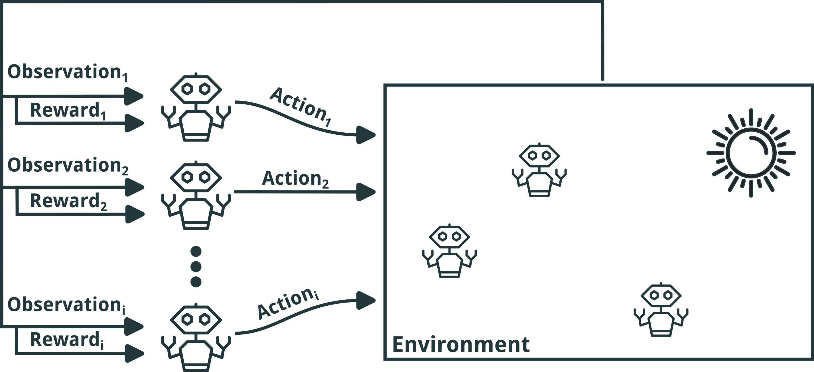

+++

title = "A Reusable Simulation Pipeline for Many-Agent Reinforcement Learning"
description = "Presentation DSRT 2024 - Main Track"
outputs = ["Reveal"]
aliases = [
    "/guide/"
]

+++

# A Reusable Simulation Pipeline for 
# Many-Agent Reinforcement Learning

[Davide Domini](mailto:davide.domini@unibo.it),
[Gianluca Aguzzi](mailto:gianluca.aguzzi@unibo.it) ,
[Danilo Pianini](mailto:danilo.pianini@unibo.it),
[Mirko Viroli](mailto:mirko.viroli@unibo.it)

International Symposium on Distributed Simulation and Real Time Applications @ DSRT 2024

 

---

# Many-Agent Reinforcement Learning

---

# MARL Examples

{}

{}

{}

<!-- {}

{} -->

{}

{}

{}

<!-- 
 -->

<!-- 
 -->

<!-- 
---
# MARL Formalization

{}
- *SwarMDP* is an extension of the classical *Markov Decision Process* (MDP) model, suitable for Many-Agent RL
{}
{}
- Formally, a SwarMDP is a tuple of a *swarming agent $\mathbb{A}$* and an *environment $\mathcal{E}$*
{}
{}
- The agent $\mathbb{A}$ is defined by:
    - $\mathcal{S}$: the set of possible *internal states* an agent can perceive
    - $\mathcal{O}$: the *environment observations* an agent can make
    - $\mathcal{A}$: the set of *actions* an agent can perform
    - $\mathcal{R}: \mathcal{O} \rightarrow \mathbb{R}$: a function mapping each *state* to a numerical *reward value*, reflecting the *desirability* of that state
    - $\pi: \mathcal{O} \rightarrow \mathcal{A}$: the agent's *policy*, mapping *observations to actions*, which can be deterministic or probabilistic
{}
{}
- The environment $\mathcal{E}$ represents the world in which the agent operates, and is defined by:
    - $\mathcal{P}$ is the *number of agents* in the system
    - $\mathbb{A}$ is a prototypical agent *defining properties* common to all agents
    - $\mathcal{T}: \mathcal{S^\mathcal{P}} \times \mathcal{A}^\mathcal{P} \times \mathcal{S^\mathcal{P}} \rightarrow \mathbb{R}^\mathcal{P}$ is the *global transition function*, determining the evolution of the system's state based on the current states and actions of all agents
    - $\xi: \mathcal{S^\mathcal{P}} \rightarrow \mathcal{O}^\mathcal{P}$ is a function *mapping the state of all agents to the corresponding observations* available to each agent
{}

 -->

<!-- ---

# MARL Formalization (2)

{}
- The *dynamic behavior* of the ManyRL system is captured by the following equations: 
    - $\textbf{o}_t = \xi(\textbf{s}_t)$: agents perceive the environment as a *set of observations*, provided by the function $\mathcal{E}$, and starting from environmental state $\textbf{s}_t$
    - $\textbf{a}_t = \pi(\textbf{o}_t)$: agents choose actions according to their *policy* $\pi$
    - $(\textbf{s}_{t+1}, \textbf{r}_t) = \mathcal{T}(\textbf{s}_t, \textbf{a}_t)$: the environment *evolves to a new state*, according to the *transition function* $\mathcal{T}$
{}
{}
- The goal of a ManyRL system is to *learn a policy $\pi$* that maximizes the *expected cumulative collective reward* over time: 
    - $\max_{\pi} \mathbb{E} \left[ \sum_{t=0}^{\infty} \sum_{i=1}^{\mathcal{P}} r^i_t \right]$
{}
{}
-  The *most common approach* to optimize the cumulative collective reward in ManyRL systems:
    - *Deep Reinforcement Learning* algorithms
    - *Centralized Training Decentralized Execution* (CTDE) paradigm as learning strategy
{}

 -->

---

# Motivation

{}
- **Challenges in Multi-Agent Reinforcement Learning (ManyRL):**
    - *Decentralized* decision-making processes lead to *complex system dynamics*
    - *Emergent behaviors* arise from *interactions* among numerous autonomous agents
{}
{}
- **Limitations of Real-World Learning:**
    - *Impractical* due to high costs, time constraints, and legal/physical restrictions
{}
{}
- **Advantages of Simulation in ManyRL Research:**
    - Enables *scalable training* of ManyRL algorithms in a controlled, safe, and cost-effective environment
    - Facilitates *exploration* of diverse scenarios, fine-tuning of policies, and evaluation of system robustness before real-world deployment
{}
{}
- **Existing Simulators:**
    - Platforms like PettingZoo and Gazebo are designed for *small-scale scenarios*
    - They lack *scalability* and *configurability*, which are critical for addressing ManyRL challenges
{}

---

# Comparison with exisisting solutions

<table>
    <thead>
        <tr>
            <th> </th>
            <th>Simulator</th>
            <th>Configurability</th>
            <th>Lifecycle Management</th>
            <th>Experience Extraction</th>
            <th>Scalability</th>
            <th>Distributed Execution</th>
            <th>Deep Learning Integration</th>
        </tr>
    </thead>
    <tbody>
        <tr>
            <td rowspan="4" style="writing-mode: vertical-lr; transform: rotate(180deg); text-align: center; vertical-align: middle;"><strong> General Purpose </strong></td>
            <td>NetLogo</td>
            <td style="color: green;">✔</td>
            <td> <strong> / </strong> </td>
            <td> <strong> / </strong> </td>
            <td>✗</td>
            <td>✗</td>
            <td>✗</td>
        </tr>
        <tr>
            <td>MESA</td>
            <td> ✔ (Modular)  </td>
            <td> <strong> / </strong> </td>
            <td> <strong> / </strong> </td>
            <td style="color: green;">✔</td>
            <td style="color: green;">✔</td>
            <td style="color: green;">✔</td>
        </tr>
        <tr>
            <td>Sibilla</td>
            <td> ✔  (Multiple Specs)</td>
            <td style="color: green;">✔</td>
            <td> <strong> / </strong> </td>
            <td>✗</td>
            <td>✗</td>
            <td>✗</td>
        </tr>
        <tr>
            <td class="fragment custom back" data-fragment-index="0" >Alchemist</td>
            <td class="fragment custom back" data-fragment-index="0" style="color: green;">✔</td>
            <td class="fragment custom back" data-fragment-index="0" style="color: green;">✔</td>
            <td class="fragment custom back" data-fragment-index="0" style="color: green;">✔</td>
            <td class="fragment custom back" data-fragment-index="0" style="color: green;">✔</td>
            <td class="fragment custom back" data-fragment-index="0" style="color: green;">✔</td>
            <td class="fragment custom back" data-fragment-index="0">  <strong> ~ </strong>   (With ScalaPy & GraalPy)</td>
        </tr>
        <!-- <tr>
            <td colspan="7"><strong>Swarm Robotics</strong></td>
        </tr> -->
        <tr>
            <td rowspan="3" style="writing-mode: vertical-lr; transform: rotate(180deg); text-align: center;"><strong>Swarm Robotics</strong></td>
            <td>ARGoS</td>
            <td>  ✔   (Limited for MARL)</td>
            <td style="color: green;">✔</td>
            <td style="color: green;">✔</td>
            <td style="color: green;">✔</td>
            <td>✗</td>
            <td>✗</td>
        </tr>
        <tr>
            <td>Gazebo</td>
            <td style="color: green;">✔</td>
            <td style="color: green;">✔</td>
            <td style="color: green;">✔</td>
            <td>✗</td>
            <td style="color: green;">✔</td>
            <td>✗</td>
        </tr>
        <tr>
            <td>Kilombo</td>
            <td>✗</td>
            <td style="color: green;">✔</td>
            <td style="color: green;">✔</td>
            <td style="color: green;">✔</td>
            <td>✗</td>
            <td>✗</td>
        </tr>
        <!-- <tr>
            <td colspan="7"><strong>Multi-agent reinforcement learning</strong></td>
        </tr> -->
        <tr>
            <td rowspan="3" style="writing-mode: vertical-lr; transform: rotate(180deg); text-align: center; vertical-align: middle;"><strong>MARL</strong></td>
            <td>PettingZoo</td>
            <td>  ✔   (Via Environments)</td>
            <td style="color: green;">✔</td>
            <td style="color: green;">✔</td>
            <td>✗</td>
            <td>✗</td>
            <td style="color: green;">✔</td>
        </tr>
        <tr>
            <td>Unity ML-Agents</td>
            <td style="color: green;">✔</td>
            <td style="color: green;">✔</td>
            <td style="color: green;">✔</td>
            <td>✗</td>
            <td>✗</td>
            <td style="color: green;">✔</td>
        </tr>
        <tr>
            <td>Neural MMO</td>
            <td>  ✔   (Task-Specific)</td>
            <td style="color: green;">✔</td>
            <td style="color: green;">✔</td>
            <td style="color: green;">✔</td>
            <td>✗</td>
            <td style="color: green;">✔</td>
        </tr>
    </tbody>
</table>

 ✔  Yes

 <strong>~</strong>  Partially, using third-party tools

 <strong>/</strong>  Limited

✗ No

 

---

# Pipeline Architecture

   

{}

{}

- Current observation $\rho$
- Action computation $\gamma$
- Environment interaction $\theta$
- Next observation $\rho_\mathcal{+}$
- Collective reward computation $R$
- Experience storage $\mathbb{E}$

{}

{}

{}

{}

---

# MARLAlchemy Prototype

 

---

# Experimental Evaluation: Scenario

- Experiment on *multi-agent flocking behavior* : agents must learn to move while maintaining *cohesive* groups and avoiding *collisions*
- Cohesion among agents is defined by two hyperparameters $\delta_U$ and $\delta_L$ (*target distance range* an agent aims to maintain from its *neighbors*)
<!-- - *$100$ agents* in a Euclidean 2D space with no boundaries -->
<!-- - Each agent has *$8$ possible movement actions* corresponding to the directions on a grid (horizontal, vertical, and diagonal) -->
- The observation space for each agent is defined as the *relative distance vector to its neighbors*: $\mathcal{O} =$ { $( x_i - x_j, y_i - y_j ) \mid j \in \mathcal{N}_i$ }
- Each agent is rewarded if the maximum distance $d$ to its neighbors is within a range $]\delta_L, \delta_U [$, and it is penalized otherwise: $\mathcal{R} =  0 \text{ if } \delta_U < d < \delta_L, \text{ otherwise } -1$

{}

{}

{}

{}

{}

{}

---

# Experimental Evaluation: Setup

- Training algorithm: *Conservative Q-Learning*
- *$9$* global *training rounds* followed by *$1$ evaluation round*
- Each global round consisted of one or more simulations, depending on the level of parallelism $p$ ( $p \in$ { $1,2,4,8$ } )
- Each simulation consisted of *$200$ episodes*
- Quality metrics:
    - Average distance of the agents from their neighbors 
    - Value of the reward function $\mathcal{R}$
- All the experiments are *publicly available* and *reproducible*

---

# Results

--- 

# Visualizing a Simulation 

---

# What's next?

- Integration of *additional learning algorithms*
- Evaluate the pipeline on a *wider range of many-agent learning scenarios*
- Integrate the pipeline within the *main Alchemist distribution*