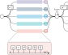

+++

title = "A Reusable Simulation Pipeline for Many-Agent Reinforcement Learning"
description = "Presentation DSRT 2024 - Main Track"
outputs = ["Reveal"]
aliases = [
    "/guide/"
]

+++

# A Reusable Simulation Pipeline for Many-Agent Reinforcement Learning

[Davide Domini](mailto:davide.domini@unibo.it),
[Gianluca Aguzzi](mailto:gianluca.aguzzi@unibo.it) ,
[Danilo Pianini](mailto:danilo.pianini@unibo.it),
[Mirko Viroli](mailto:mirko.viroli@unibo.it)

International Symposium on Distributed Simulation and Real Time Applications @ DSRT 2024

 

---

# Motivation

---

# MARL Formalization

---

# Pipeline Architecture

   

{}

{}

- Current observation $\rho$
- Action computation $\gamma$
- Environment interation $\theta$
- Next observatiobn $\rho_\mathcal{+}$
- Collective reward computation $R$
- Experience storage $\mathbb{E}$

{}

{}

{}

{}

---

# Comparison with exisisting solutions

<table>
    <thead>
        <tr>
            <th> </th>
            <th>Simulator</th>
            <th>Configurability</th>
            <th>Lifecycle Management</th>
            <th>Experience Extraction</th>
            <th>Scalability</th>
            <th>Distributed Execution</th>
            <th>Deep Learning Integration</th>
        </tr>
    </thead>
    <tbody>
        <tr>
            <td rowspan="4" style="writing-mode: vertical-lr; transform: rotate(180deg); text-align: center; vertical-align: middle;"><strong> General Purpose </strong></td>
            <td>NetLogo</td>
            <td style="color: green;">✔</td>
            <td> <strong> / </strong> </td>
            <td> <strong> / </strong> </td>
            <td>✗</td>
            <td>✗</td>
            <td>✗</td>
        </tr>
        <tr>
            <td>MESA</td>
            <td> ✔ (Modular)  </td>
            <td> <strong> / </strong> </td>
            <td> <strong> / </strong> </td>
            <td style="color: green;">✔</td>
            <td style="color: green;">✔</td>
            <td style="color: green;">✔</td>
        </tr>
        <tr>
            <td>Sibilla</td>
            <td> ✔  (Multiple Specs)</td>
            <td style="color: green;">✔</td>
            <td> <strong> / </strong> </td>
            <td>✗</td>
            <td>✗</td>
            <td>✗</td>
        </tr>
        <tr>
            <td>Alchemist</td>
            <td style="color: green;">✔</td>
            <td style="color: green;">✔</td>
            <td style="color: green;">✔</td>
            <td style="color: green;">✔</td>
            <td style="color: green;">✔</td>
            <td>  <strong> ~ </strong>   (Partially with ScalaPy & GraalPy)</td>
        </tr>
        <!-- <tr>
            <td colspan="7"><strong>Swarm Robotics</strong></td>
        </tr> -->
        <tr>
            <td rowspan="3" style="writing-mode: vertical-lr; transform: rotate(180deg); text-align: center;"><strong>Swarm Robotics</strong></td>
            <td>ARGoS</td>
            <td>  ✔   (Limited for MARL)</td>
            <td style="color: green;">✔</td>
            <td style="color: green;">✔</td>
            <td style="color: green;">✔</td>
            <td>✗</td>
            <td>✗</td>
        </tr>
        <tr>
            <td>Gazebo</td>
            <td style="color: green;">✔</td>
            <td style="color: green;">✔</td>
            <td style="color: green;">✔</td>
            <td>✗</td>
            <td style="color: green;">✔</td>
            <td>✗</td>
        </tr>
        <tr>
            <td>Kilombo</td>
            <td>✗</td>
            <td style="color: green;">✔</td>
            <td style="color: green;">✔</td>
            <td style="color: green;">✔</td>
            <td>✗</td>
            <td>✗</td>
        </tr>
        <!-- <tr>
            <td colspan="7"><strong>Multi-agent reinforcement learning</strong></td>
        </tr> -->
        <tr>
            <td rowspan="3" style="writing-mode: vertical-lr; transform: rotate(180deg); text-align: center; vertical-align: middle;"><strong>MARL</strong></td>
            <td>PettingZoo</td>
            <td>  ✔   (Via Environments)</td>
            <td style="color: green;">✔</td>
            <td style="color: green;">✔</td>
            <td>✗</td>
            <td>✗</td>
            <td style="color: green;">✔</td>
        </tr>
        <tr>
            <td>Unity ML-Agents</td>
            <td style="color: green;">✔</td>
            <td style="color: green;">✔</td>
            <td style="color: green;">✔</td>
            <td>✗</td>
            <td>✗</td>
            <td style="color: green;">✔</td>
        </tr>
        <tr>
            <td>Neural MMO</td>
            <td>  ✔   (Task-Specific)</td>
            <td style="color: green;">✔</td>
            <td style="color: green;">✔</td>
            <td style="color: green;">✔</td>
            <td>✗</td>
            <td style="color: green;">✔</td>
        </tr>
    </tbody>
</table>

   

---

# MARLAlchemy Prototype

---

# Experimental Evaluation: Scenario

- Experiment on *multi-agent flocking behavior* : agents must learn to move while maintaining *cohesive* groups and avoiding *collisions*
- Cohesion among agents is defined by two hyperparameters $\delta_U$ and $\delta_L$ (*target distance range* an agent aims to maintain from its *neighbors*)
- *$100$ agents* in a Euclidean 2D space with no boundaries
- Each agent has *$8$ possible movement actions* corresponding to the directions on a grid (horizontal, vertical, and diagonal)
- The observation space for each agent is defined as the *relative distance vector to its neighbors*: $\mathcal{O} =$ { $( x_i - x_j, y_i - y_j ) \mid j \in \mathcal{N}_i$ }
- Each agent is rewarded if the maximum distance $d$ to its neighbors is within a range $]\delta_L, \delta_U [$, and it is penalized otherwise: $\mathcal{R} =  0 \text{ if } \delta_U < d < \delta_L, \text{ otherwise } -1$

---

# Experimental Evaluation: Setup

- Training algorithm: *Conservative Q-Learning*
- *$9$* global *training rounds* followed by *$1$ evaluation round*
- Each global round consisted of one or more simulations, depending on the level of multiple simulation parallelism $p$ ( $p \in$ { $1,2,4,8$ } )
- Each simulation consisted of *$200$ episodes*
- Quality metrics:
    - Average distance of the agents from their neighbors 
    - Value of the reward function $\mathcal{R}$
- All the experiments are *publicly available* and *reproducible*

---

# Results

--- 

# Visualizing a Simulation 

---

# Conclusion and Future Work
